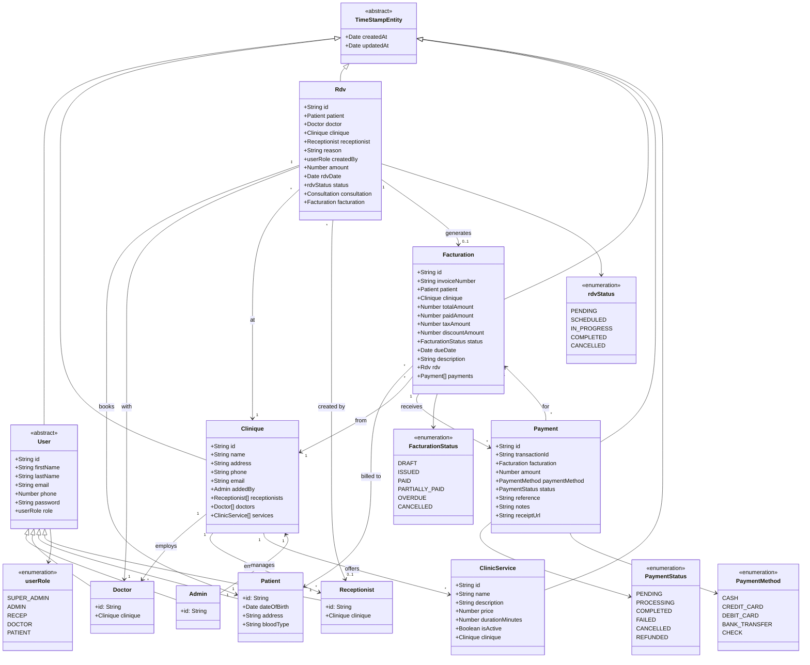

# 🏥 MedFlow — SaaS pour Cliniques & Médecins

## 📘 Titre du projet

**MedFlow** — Solution SaaS de gestion pour cliniques et médecins, développée avec **React / Next.js**.

---

## 🎯 1. Contexte & Objectifs

MedFlow vise à **digitaliser la gestion d’une clinique médicale** à travers une plateforme web moderne, sécurisée et intuitive.

### Objectifs principaux

- Simplifier la **gestion des patients, médecins, rendez-vous et factures**.
- Offrir un **portail patient** pour la réservation, la consultation et le téléchargement de documents médicaux.
- Permettre aux étudiants/développeurs de pratiquer :
  - la **conception logicielle**,
  - le **développement full-stack**,
  - la **sécurité des applications web**,
  - et le **déploiement SaaS**.

## Project setup

```bash
npm install
docker compose up --build --detach
npx prisma migrate dev
```

## Compile and run the project

```bash
# watch mode dev
$ npm run start:dev
```

---

## 🏗️ Architecture & Class Diagram

### Class Diagram (Mermaid)



---

## ✨ Features

### 🔐 Authentication & Authorization

- **JWT-based authentication** with role-based access control (RBAC)
- **Multi-role system**: Super Admin, Admin, Receptionist, Doctor, Patient
- **Secure password hashing** using bcrypt
- **Protected routes** with Guards and Decorators

### 👥 User Management

- **User hierarchy**: Admin, Doctor, Patient, Receptionist
- **Role-specific operations**: Create, read, update, delete users
- **User profile management** with specific attributes per role
- **Multi-clinic user assignment**

### 🏥 Clinic Management

- **Multi-clinic support** (SaaS architecture)
- **Clinic CRUD operations**
- **User assignment to clinics** (doctors, receptionists)
- **Clinic-specific services** management

### 📅 Appointment (Rendez-vous) Management

- **Appointment booking** by patients or receptionists
- **Status tracking**: Pending, Scheduled, In Progress, Completed, Cancelled
- **Doctor assignment** and clinic selection
- **Consultation details** (examination, diagnosis, treatment)
- **Appointment history** and filtering

### 💰 Billing & Invoicing (Facturation)

- **Automatic invoice generation** from appointments
- **Multiple invoice statuses**: Draft, Issued, Paid, Partially Paid, Overdue, Cancelled
- **Tax and discount management**
- **Due date tracking**
- **Patient and clinic-specific invoicing**

### 💳 Payment Management

- **Multiple payment methods**: Cash, Credit Card, Debit Card, Bank Transfer, Check
- **Payment status tracking**: Pending, Processing, Completed, Failed, Cancelled, Refunded
- **Transaction ID tracking**
- **Payment history** per invoice
- **Refund functionality**

### 🏥 Clinic Services

- **Service catalog** per clinic
- **Price and duration management**
- **Service activation/deactivation**
- **Service-based billing**

---

## 📡 API Documentation

### 🔐 Authentication (`/auth`)

| Method | Endpoint         | Description                | Access        |
| ------ | ---------------- | -------------------------- | ------------- |
| `POST` | `/auth/register` | Register a new user        | Public        |
| `POST` | `/auth/login`    | Login and get JWT token    | Public        |
| `GET`  | `/auth/curr`     | Get current logged-in user | Authenticated |

### 👥 Users (`/users`)

| Method   | Endpoint                | Description                               | Access             |
| -------- | ----------------------- | ----------------------------------------- | ------------------ |
| `GET`    | `/users`                | Get all users (with optional role filter) | Authenticated      |
| `GET`    | `/users/:role/:id`      | Get user by ID and role                   | Authenticated      |
| `POST`   | `/users/create-admin`   | Create admin user                         | Super Admin        |
| `POST`   | `/users/create-recep`   | Create receptionist                       | Super Admin, Admin |
| `POST`   | `/users/create-doctor`  | Create doctor                             | Super Admin, Admin |
| `POST`   | `/users/create-patient` | Create patient                            | Receptionist       |
| `DELETE` | `/users/:role/:id`      | Delete user by ID                         | Authenticated      |

### 🏥 Clinics (`/clinique`)

| Method   | Endpoint                | Description                          | Access             |
| -------- | ----------------------- | ------------------------------------ | ------------------ |
| `GET`    | `/clinique`             | Get all clinics (or admin's clinics) | Authenticated      |
| `GET`    | `/clinique/:id`         | Get clinic by ID                     | Authenticated      |
| `POST`   | `/clinique`             | Create new clinic                    | Super Admin, Admin |
| `PATCH`  | `/clinique/:id`         | Update clinic                        | Super Admin, Admin |
| `PATCH`  | `/clinique/assign-user` | Assign user to clinic                | Super Admin, Admin |
| `DELETE` | `/clinique/:id`         | Delete clinic                        | Super Admin, Admin |

### 📅 Appointments (`/rdv`)

| Method  | Endpoint                 | Description                                  | Access                |
| ------- | ------------------------ | -------------------------------------------- | --------------------- |
| `GET`   | `/rdv`                   | Get all appointments                         | Authenticated         |
| `GET`   | `/rdv/:id`               | Get appointment by ID                        | Authenticated         |
| `POST`  | `/rdv`                   | Create new appointment                       | Receptionist, Patient |
| `PATCH` | `/rdv/:id/change-status` | Update appointment status & add consultation | Receptionist, Doctor  |

### 💰 Invoicing (`/facturation`)

| Method   | Endpoint                              | Description                     | Access        |
| -------- | ------------------------------------- | ------------------------------- | ------------- |
| `GET`    | `/facturation`                        | Get all invoices (with filters) | Authenticated |
| `GET`    | `/facturation/:id`                    | Get invoice by ID               | Authenticated |
| `GET`    | `/facturation/invoice/:invoiceNumber` | Get invoice by invoice number   | Authenticated |
| `GET`    | `/facturation/patient/:patientId`     | Get patient invoices            | Authenticated |
| `GET`    | `/facturation/clinic/:cliniqueId`     | Get clinic invoices             | Authenticated |
| `GET`    | `/facturation/overdue/all`            | Get overdue invoices            | Authenticated |
| `GET`    | `/facturation/rdv/:rdvId`             | Get invoice by appointment      | Authenticated |
| `GET`    | `/facturation/rdv/all/list`           | Get all appointment invoices    | Authenticated |
| `POST`   | `/facturation`                        | Create new invoice              | Authenticated |
| `PATCH`  | `/facturation/:id`                    | Update invoice                  | Authenticated |
| `PATCH`  | `/facturation/:id/status`             | Update invoice status           | Authenticated |
| `DELETE` | `/facturation/:id`                    | Delete invoice                  | Authenticated |

### 💳 Payments (`/payments`)

| Method   | Endpoint                                 | Description                     | Access        |
| -------- | ---------------------------------------- | ------------------------------- | ------------- |
| `GET`    | `/payments`                              | Get all payments (with filters) | Authenticated |
| `GET`    | `/payments/:id`                          | Get payment by ID               | Authenticated |
| `GET`    | `/payments/transaction/:transactionId`   | Get payment by transaction ID   | Authenticated |
| `GET`    | `/payments/facturation/:facturatationId` | Get payments by invoice         | Authenticated |
| `GET`    | `/payments/rdv/:rdvId`                   | Get payments by appointment     | Authenticated |
| `POST`   | `/payments`                              | Create new payment              | Authenticated |
| `POST`   | `/payments/:id/process`                  | Process payment                 | Authenticated |
| `POST`   | `/payments/:id/refund`                   | Refund payment                  | Authenticated |
| `PATCH`  | `/payments/:id`                          | Update payment                  | Authenticated |
| `DELETE` | `/payments/:id`                          | Delete payment                  | Authenticated |

### 🏥 Clinic Services (`/clinic-services`)

| Method   | Endpoint                              | Description                           | Access        |
| -------- | ------------------------------------- | ------------------------------------- | ------------- |
| `GET`    | `/clinic-services`                    | Get all services (with clinic filter) | Authenticated |
| `GET`    | `/clinic-services/:id`                | Get service by ID                     | Authenticated |
| `GET`    | `/clinic-services/clinic/:cliniqueId` | Get services by clinic                | Authenticated |
| `POST`   | `/clinic-services`                    | Create new service                    | Authenticated |
| `PATCH`  | `/clinic-services/:id`                | Update service                        | Authenticated |
| `DELETE` | `/clinic-services/:id`                | Delete service                        | Authenticated |

---

## 🔑 Key Technical Features

### Technologies Used

- **Framework**: NestJS (Node.js)
- **Language**: TypeScript
- **ORM**: TypeORM
- **Database**: PostgreSQL (via Docker)
- **Authentication**: JWT (JSON Web Tokens)
- **Validation**: Class-validator & Class-transformer
- **API Style**: RESTful

### Design Patterns

- **Module-based architecture** (NestJS modules)
- **Repository pattern** (TypeORM repositories)
- **Dependency injection**
- **Guards & Decorators** for authorization
- **DTOs (Data Transfer Objects)** for validation
- **Entity inheritance** (User hierarchy)

### Security Features

- **Password hashing** with bcrypt
- **JWT token-based authentication**
- **Role-based access control (RBAC)**
- **Route guards** for protected endpoints
- **Input validation** using DTOs

---

## 🚀 Getting Started

### Prerequisites

- Node.js (v18+)
- Docker & Docker Compose
- npm or yarn

### Installation & Setup

1. **Install dependencies**:

```bash
npm install
```

2. **Start the database**:

```bash
docker compose up --build --detach
```

3. **Run database migrations**:

```bash
npx prisma migrate dev
```

4. **Start the development server**:

```bash
npm run start:dev
```

The API will be available at `http://localhost:3000`

---

## 📊 Database Schema

The application uses **PostgreSQL** with **TypeORM** as the ORM. All entities extend a base `TimeStampEntity` that provides automatic `createdAt` and `updatedAt` timestamps.

### Entity Relationships

- **One-to-Many**: Clinique → Doctors, Receptionist → Appointments
- **Many-to-One**: Appointments → Patient, Payment → Invoice
- **One-to-One**: Appointment → Invoice (optional)
- **Inheritance**: User → Admin, Doctor, Patient, Receptionist
